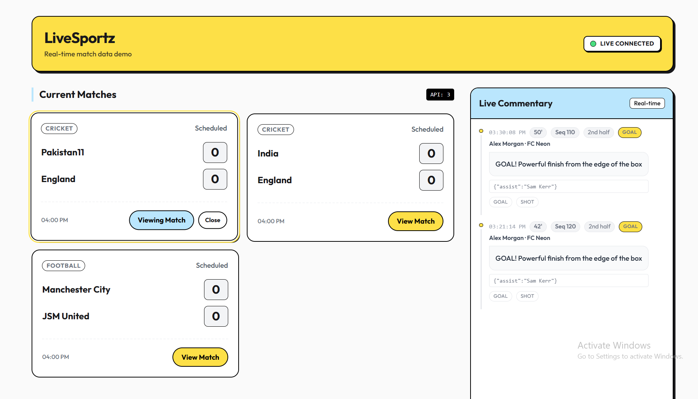

# ⚡ LiveSportz – Real-Time Broadcast Engine

A high-performance <b>Real-Time Sports Broadcast Engine</b> capable of delivering
<b>live match scores, commentary, and ball-by-ball updates</b> to
<b>100,000+ simultaneous users</b> with sub-second latency.

This project demonstrates how to architect a scalable system capable of broadcasting real-time data to millions of users without crashing the server.

---

## 📊 Real-Time Score Updates

---

# ✨ Features

⚡ **Real-Time Match Updates**  
Live scores, commentary, and ball-by-ball updates.

🚀 **High-Frequency Broadcast Engine**  
Handles **100,000+ concurrent users**.

📡 **Sub-Second Latency**  
Ultra-fast event broadcasting.

🔗 **API & Admin Data Ingestion**  
Ingest data from APIs or admin dashboard.

📊 **Live Commentary Feed**  
Stream match commentary in real-time.

🛡 **Secure & Reliable Infrastructure**  
Built with monitoring and protection tools.

---

The server broadcasts real-time match updates through a **WebSocket-based event engine**, ensuring ultra-fast delivery with minimal delay.

# 🛠 Tech Stack

### Frontend
- React
- Tailwind CSS

### Backend
- Node.js
- Express.js

### Real-Time Engine
- WebSockets
- Event Broadcasting

### Database
- MongoDB

---

